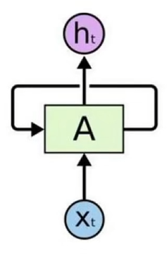

# Transformer

###### *链接：https://github.com/huggingface/transformers*

## 传统的RNN网络的痛点

1. **序列依赖限制**：需按顺序处理输入，无法并行计算，效率低下，尤其长序列场景。

2. **长程依赖丢失**：随序列长度增加，梯度消失 / 爆炸问题严重，难以捕捉远距离关联。

3. **上下文感知局限**：仅依赖前序信息（单向 RNN）或局部双向信息（如 LSTM/GRU），对全局上下文建模能力弱。

   ## Transformer突破

   1、用**自注意力机制**替代递归结构，可并行处理序列，直接计算任意位置间的关联，高效捕捉长程依赖。

   2、结合**位置编码**保留序列顺序信息，通过多头注意力实现多维度上下文建模，彻底解决 RNN 的固有瓶颈。

   

### 	1、Self-Attention

*上图中，it所代指的主语是不同的，随着语义的变化，本文代指tired、narrow,it是随上下文的语义变化。*

核心：**<u>在序列中，让每个元素动态关注其他所有元素，计算它们之间的关联权重，最终用这些权重加权整合所有元素的信息，得到每个元素的新表示。</u>**

通过让每个元素的输出都融入整个序列的上下文信息，解决了 RNN对长序列文本数据之间依赖捕捉弱、无法并行计算的问题。

### 	2、self-attention的计算

输入数据的关系，通过内积来衡量

核心：**是通过三个矩阵（Q、K、V）建模序列内元素的关联**

1. **生成 Q、K、V 矩阵**
   对输入序列的每个元素向量，分别乘以可学习的权重矩阵，得到三个新向量：

   - Query（Q）：当前元素 “要查询什么”
   - Key（K）：其他元素 “提供什么信息”
   - Value（V）：其他元素 “具体的信息内容”

2. **计算注意力权重**
   用 Q 与 K 的点积计算元素间的关联度（相似性），再通过缩放和 Softmax 归一化，得到每个元素对其他所有元素的注意力权重（权重和为 1）。

3. **加权整合信息**

   用步骤 2 得到的权重，对所有元素的 Value（V)进行加权求和，得到每个元素融合了全局上下文的新表示。

$$
Attention(Q,K,V) = Softmax(Q·K^T / √d_k) · V
$$

$$
√d_k 维度，做归一化
$$

#### 	3、Multi-Head Attention

核心：**从多个不同维度捕捉序列中元素的关联关系**

- **步骤 1：拆分与并行计算**
  对输入的 Q、K、V 向量，通过线性变换拆分成`h`组（即 “多头”，`h`为超参数，如 8 头），每组独立执行自注意力计算（即每组都计算 Q 与 K 的关联权重，再加权 V），得到`h`个不同的注意力输出矩阵。

- **步骤 2：拼接与整合**
  将`h`个输出矩阵拼接成一个大矩阵，再通过一次线性变换压缩维度，得到最终的多头注意力输出。

  *单一自注意力可能只捕捉到某一种关联（如局部邻近词），而多头机制通过并行计算，能同时学习到**多组不同的 Q、K、V 映射**，从而捕捉到更丰富的全局依赖（如语义、语法、长距离 / 短距离关联等），提升了模型对复杂序列的理解能力。*

  ### 4、残差连接

*在反向传播时，梯度可以通过残差项 `x` 直接 “短路” 传递（梯度 = 1 + 梯度 (F (x))），避免梯度随网络深度增加而急剧衰减，使深层网络的梯度能有效回传。*

### 	5、Masked Multi-Head Attention

​	核心：**在生成序列时，确保模型只能 “看到” 当前及之前的元素，无法提前获取未来信息**

​	mask机制：**人为屏蔽未来位置的关联，强制模型基于已有信息预测下一个元素**

​	**步骤 1**：在计算注意力权重（Q 与 K 的点积）后，对 “未来位置” 的权重值加上一个**极大的负数（如 - 1e9）**。

​	**步骤 2**：经过 Softmax 归一化后，这些被掩码的位置权重会趋近于 0，相当于被 “屏蔽”，不再对当前元素的表示产生影响。

- ### 6、Multi-Head Attention

  核心：**让解码器生成的内容精准对齐编码器理解的输入信息**

  与自注意力机制类似，它通过 Q、K、V 矩阵计算注意力，但**Q、K、V 的来源不同**：

  **Query（Q）**：来自解码器前一层的输出（即 “已生成的目标序列信息”，如翻译到一半的目标句子）。

  **Key（K）和 Value（V）**：均来自编码器的最终输出（即 “输入序列的全局上下文信息”，如完整的源语言句子编码）。

# Transformer总结：

### 1. 输入处理（编码器 + 解码器共享）

- 对输入文本（如源语言句子）和输出文本（如目标语言句子）分别做**词嵌入（Word Embedding）**，将离散词转为低维向量。
- 加入**位置编码（Positional Encoding）**，为向量注入序列位置信息（解决自注意力对顺序不敏感的问题），得到编码器输入和解码器输入的初始向量。

### 2. 编码器（Encoder）流程

编码器由**N 个相同的编码器层**堆叠而成（每层结构一致），输入向量依次经过所有编码器层后，输出 “编码后的全局上下文向量”：

- 每个编码器层包含两步：

  1. **多头自注意力机制**：对输入序列做自注意力（每个词关注序列中所有词），输出融合全局信息的向量。
  2. **前馈神经网络（Feed Forward Network）**：对多头注意力的输出做线性变换和非线性激活（如 ReLU），增强模型拟合能力。

  - 每层的两个步骤后均加入**残差连接（Residual Connection）** 和**层归一化（Layer Normalization）**，缓解梯度消失，加速训练。

### 3. 解码器（Decoder）流程

解码器同样由**N 个相同的解码器层**堆叠而成，输入是 “目标序列的初始向量”，输出是 “最终生成的序列概率分布”：

- 每个解码器层包含三步：

  1. **掩码多头自注意力机制**：对目标序列做自注意力，但通过掩码（Mask）屏蔽未来位置的信息（避免 “偷看” 还未生成的词，保证生成的顺序性）。
  2. **编码器 - 解码器注意力机制**：用解码器的 Query 向量，对编码器输出的 Key 和 Value 做注意力（让生成的词关注输入序列的相关部分，如翻译中 “目标词” 对齐 “源词”）。
  3. **前馈神经网络**：与编码器的前馈网络结构一致，对输出做非线性变换。

  - 每步后同样加入**残差连接**和**层归一化**。

### 4. 输出层

解码器的最终输出经过**线性变换**（映射到词表维度）和**Softmax 激活**，得到每个位置的词概率分布，通过贪心搜索或束搜索生成最终序列（如翻译结果、摘要等）。

# VIT

*链接：https://github.com/lucidrains/vit-pytorch?tab=readme-ov-file*

**解决：摒弃了 CNN 的局部卷积操作，直接用自注意力捕捉图像全局依赖，在大规模数据训练下性能超越传统 CNN**。

### 1、Patch Embedding

- 将输入图像（如 224×224×3）分割为固定大小的非重叠区域（如 16×16×3），共得到 (224/16)×(224/16)=196 个区域。
- 每个区域通过线性投影（Linear Projection）转化为固定维度的向量（如 768 维），相当于 NLP 中的 “词嵌入”，得到 196 个 “区域嵌入向量”。

### 2、Class Token

- 在区域序列前额外添加一个可学习的 “类别令牌（[CLS]）” 向量（同维度 768），专门用于最终的分类任务。
- 此时序列长度变为 196+1=197。

### 3、Positional Encoding

- 为保留区域的空间位置信息，给每个区域嵌入向量（包括 [CLS]）添加一个可学习的 “位置编码向量”。
- 与 Transformer 类似，位置编码确保模型能感知区域在图像中的空间顺序。

### 4、Transformer 编码器处理

- 将上述带位置信息的序列输入到**多个堆叠的 Transformer 编码器层**（如 12 层）。
- 每个编码器层包含：
  - 多头自注意力机制：让每个区域（包括 [CLS]）关注其他所有区域，学习全局空间关联（如 “猫的头部” 与 “尾巴” 的关联）。
  - 前馈神经网络：对注意力输出做非线性变换，增强模型拟合能力。
  - 残差连接和层归一化：稳定训练。

### 5、分类头（Classification Head）

- 经过 Transformer 编码后，提取 [CLS] 令牌的输出向量（已融合全局图像信息）。
- 通过一个简单的分类头（如单层全连接网络），将 [CLS] 向量映射到类别数量（如 1000 类），得到最终的分类概率。
